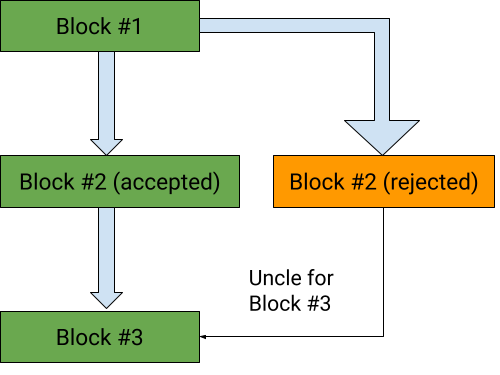
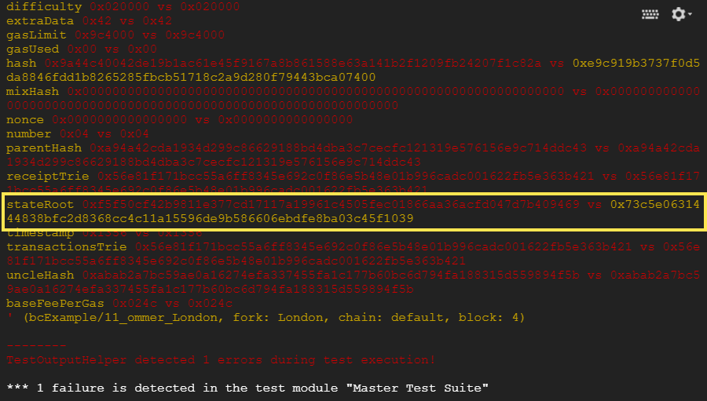

.. ommer-tests-tutorial:

###########################################
Blocktests with Ommer / Uncle Blocks
###########################################
`Ori Pomerantz <mailto://qbzzt1@gmail.com>`_

In this tutorial you learn how to write blockchain tests where the chain
includes `ommer/uncle blocks <https://ethereum.org/en/glossary/#ommer>`_,
blocks that are not part of the main chain but still deserve a reward.

Uncle Blocks
============
Uncle blocks are created because there are multiple miners working at any point
in time. If two miners propose a follow-up block for the chain, only one of them
becomes the real block, but the other miner who did the same work also deserves
a reward (otherwise the chances of getting a mining reward will be too low, and there will
be a lot less miners to keep the blockchain going).

        from block 1, and is recognized as an uncle by block 3.

For example, in the illustration above block #1 was proposed by a miner and accepted.
Then two separate miners created followup blocks labeled as 2. One of them is the block
that was eventually accepted, the green 2. The other one is the orange block that was
eventually rejected. Then a miner (one of the ones above or a separate one) created
block 3 and specified that the green 2 is the parent block and the orange 2 is an
uncle / ommer block (ommer is a gender neutral term for an uncle or aunt). This 
way the miner that created the green 2 block gets the full reward (2 ETH), but the one
who created the orange 2 still gets something (1.75 ETH in this case).

Writing Tests
===============
The test writing process for ommer tests is a bit complicated. First you write a test file
such as **11_ommerFiller.yml**, which has the uncle information, and run the test. However,
this test always fails. The state root that is calculated by retesteth in the uncle
block is different from the actual state root, because it does not include the payment
to the miner of the uncle block.

Writing the Filler File
-----------------------
The only fields of the uncle block that matter are in the header, so you don't specify
them in the filler file as blocks, but as a list of uncle block headers. For example,
here is block 4 from `11_ommerFiller.yml 
<https://github.com/ethereum/tests/blob/develop/docs/tutorial_samples/11_ommerFiller.yml/>`_.

::

  - blocknumber: 4
    transactions: []
    uncleHeaders:
      - populateFromBlock: 1
        extraData: 0x43
        coinbase: 0xCCCCCCCCCCCCCCCCCCCCCCCCCCCCCCCCCCCCCCCC
      - populateFromBlock: 2
        extraData: 0x43
        coinbase: 0xBBBBBBBBBBBBBBBBBBBBBBBBBBBBBBBBBBBBBBBB

As you can see, the **uncleHeaders** list contains two uncles. The first 
is an attempt to continue block 1, so it is an alternative block 2. The second
is an attempt to continue block 2, so it is an alternative block 3.

.. note::
   Most of the header fields are copied from the parent, except for the 
   ones we explicitly specify (in this case, **extraData** and **coinbase**).

Correcting the State Root
-------------------------
When you run this test it is guaranteed to fail. The reason is that the state
root that **retesteth** calculates is wrong, because it ignores the payments to
the miners that created the uncles (in this case, 0xCC...CC and 0xBB...BB)
So you can expect an error message similar to this:

As you can see, the field that is different is **stateRoot** (and **hash**, which is 
the hash of everything so if there are any differences it ends up different too). 
When you put that field in the block header with the correct value the test works, 
as you can see by running `12_ommerGoodFiller.yml 
<https://github.com/ethereum/tests/blob/develop/docs/tutorial_samples/12_ommerGoodFiller.yml/>`_.

Conclusion
==========
The main case in which new ommer tests are needed is when the block header is modified
and we need to make sure that only valid block headers are accepted, not just in the main
chain but also as ommers. `Here is an example of such a test
<https://github.com/ethereum/tests/blob/develop/src/BlockchainTestsFiller/TransitionTests/bcBerlinToLondon/londonUnclesFiller.json>`_.
Hopefully you now know enough to write this kind of test.

